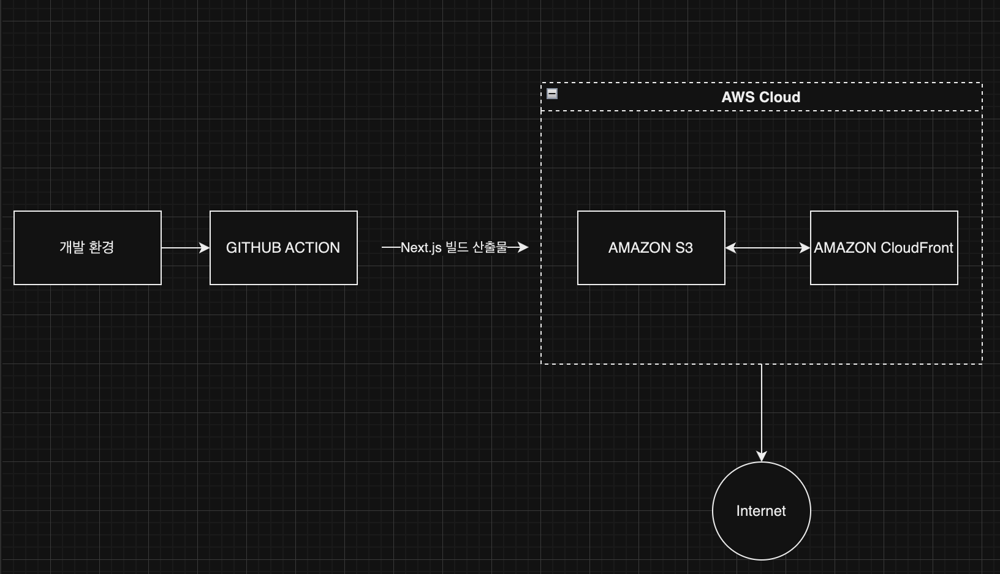

# Next.js CI/CD 파이프라인 구축

## 프로젝트 소개

AWS S3를 이용해서 Next.js 애플리케이션의 정적 파일을 호스팅하고,</br> CloudFront를 활용해서 콘텐츠를 효율적으로 전달하는 CDN을 구성한 후,</br> Next.js 프로젝트에 GitHub Actions를 통한 자동 배포 파이프라인을 구축하였습니다.



## 상세 구현 내용

### 1. AWS 인프라 구성

#### S3 버킷 설정

- 버킷 생성 및 정적 웹 사이트 호스팅 활성화
- 퍼블릭 액세스 차단 설정
- CloudFront 배포를 위한 버킷 정책 설정

#### CloudFront 설정

- Origin Domain 설정 (S3 버킷 연결)
- OAI(Origin Access Identity) 생성 및 연결
- 기본 캐시 동작 설정 (Redirect HTTP to HTTPS)
- 오류 페이지 설정 (/index.html로 리다이렉트)

### 2. Next.js 프로젝트 설정

#### next.config.js

```javascript
/** @type {import('next').NextConfig} */
const nextConfig = {
  output: 'export',
  trailingSlash: true,
}

module.exports = nextConfig
```

### 3. CI/CD 파이프라인 구축

#### GitHub Actions 워크플로우 (.github/workflows/deployment.yml)

```yaml
name: 배포 워크플로우 (Next.js, S3, CloudFront)

on:
  push:
    branches:
      - main
  workflow_dispatch:

jobs:
  deploy:
    runs-on: ubuntu-latest

    steps:
      - name: 코드 체크아웃
        uses: actions/checkout@v2

      - name: 노드 버전 설정 (ver.20)
        uses: actions/setup-node@v2
        with:
          node-version: '20'

      - name: 프로젝트 의존성 설치
        run: npm ci

      - name: 프로젝트 빌드
        run: npm run build

      - name: AWS 자격 증명 설정
        uses: aws-actions/configure-aws-credentials@v1
        with:
          aws-access-key-id: ${{ secrets.AWS_ACCESS_KEY_ID }}
          aws-secret-access-key: ${{ secrets.AWS_SECRET_ACCESS_KEY }}
          aws-region: ${{ secrets.AWS_REGION }}

      - name: S3에 배포
        run: |
          aws s3 sync out/ s3://${{ secrets.S3_BUCKET_NAME }} --delete

      - name: CloudFront 캐시 무효화
        run: |
          aws cloudfront create-invalidation --distribution-id ${{ secrets.CLOUDFRONT_DISTRIBUTION_ID }} --paths "/*"
```

### 4. GitHub Secrets 설정

필요한 시크릿 값:

- AWS_ACCESS_KEY_ID : IAM 계정 생성시 발급받는 액세스 키
- AWS_SECRET_ACCESS_KEY : IAM 계정 생성시 발급받은 비밀 엑세스 키
- AWS_REGION : S3을 세팅한 region(지역) 코드
- S3_BUCKET_NAME : 빌드 산출물을 업로드할 S3 버킷 이름
- CLOUDFRONT_DISTRIBUTION_ID : S3과 연결된 CloudFront 배포 ID

### 5. 배포 프로세스 (Git flow)

1. 작업사항을 feature브랜치에 올린 후 main브랜치에 pr요청
2. 코드리뷰가 완료되면 main브랜치에 merge
3. GitHub Actions 워크플로우 자동 실행
4. Next.js 프로젝트 빌드
5. 빌드된 파일을 S3에 업로드
6. CloudFront 캐시 무효화

### 6. 주요 이점

- 자동화된 배포로 인한 개발 생산성 향상
- CloudFront CDN을 통한 글로벌 콘텐츠 전송
- S3 정적 호스팅을 통한 비용 효율적인 운영

</br>

## 성능 분석

<div style="display: flex; justify-content: space-around;">
  
  
</div>

</br>
</br>

실제 성능 측정 결과
실제 배포된 Next.js 애플리케이션의 네트워크 응답을 분석한 결과입니다.

1. 파일 크기 비교

   | 파일명                       | S3 크기 | CloudFront 크기 | 감소율 |
   | ---------------------------- | ------- | --------------- | ------ |
   | fd9d1056-aa94ea5c2eabf904.js | 173 kB  | 51.1 kB         | 70.5%  |
   | 117-b2ec9b1a6eddcaeb.js      | 124 kB  | 30.6 kB         | 75.3%  |
   | webpack-0dae0f0b0d2941b8.js  | 3.8 kB  | 1.9 kB          | 50%    |

2. 응답 시간 비교

   | 리소스 유형 | S3 응답 시간 | CloudFront 응답 시간 | 개선율   |
   | ----------- | ------------ | -------------------- | -------- |
   | JavaScript  | 26-83ms      | 12-34ms              | 최대 59% |
   | CSS         | 31ms         | 16ms                 | 48%      |
   | 폰트        | 31-35ms      | 17-18ms              | 약 45%   |
   | 기타 리소스 | 28-49ms      | 11-12ms              | 최대 75% |

3. 성능 최적화

   - 엣지 로케이션을 통한 빠른 컨텐츠 전송
   - 효율적인 캐싱으로 응답 시간 단축

4. 안정성 향상

   - 글로벌 CDN 네트워크 활용
   - 원본 서버(S3) 부하 감소
   - 일관된 응답 시간 제공

5. 비용 효율성

   - 대역폭 사용량 감소
   - 전송 비용 최적화
   - 서버 리소스 사용 효율화

## 참고 사항

### 1. 주요 개념

#### [**GitHub Actions과 CI/CD 도구**](https://github.com/resources/articles/devops/ci-cd)

GitHub Actions는 소프트웨어 개발 워크플로우를 자동화하는 CI/CD 플랫폼입니다. 코드 변경사항이 main 브랜치에 푸시되면 자동으로 빌드, 테스트, 배포 과정을 실행합니다. 이를 통해 개발자는 수동 작업 없이 안정적인 배포를 수행할 수 있습니다.

#### [**S3와 스토리지**](https://aws.amazon.com/ko/s3/features/)

Amazon S3(Simple Storage Service)는 확장 가능한 객체 스토리지 서비스입니다.</br>
이 프로젝트에서는 Next.js로 빌드된 정적 파일들을 호스팅하는 용도로 사용됩니다. 정적 웹사이트 호스팅 기능을 통해 웹 서버 없이도 콘텐츠를 제공할 수 있습니다.

#### [**CloudFront와 CDN**](https://docs.aws.amazon.com/ko_kr/AmazonCloudFront/latest/DeveloperGuide/Introduction.html)

CloudFront는 AWS의 CDN(Content Delivery Network) 서비스입니다. 전 세계에 분산된 엣지 로케이션을 통해 콘텐츠를 캐싱하고 사용자와 가까운 위치에서 콘텐츠를 제공함으로써 지연 시간을 최소화하고 성능을 향상시킵니다.

#### [**캐시 무효화(Cache Invalidation)**](https://docs.aws.amazon.com/ko_kr/AmazonCloudFront/latest/DeveloperGuide/Invalidation.html)

CloudFront는 엣지 로케이션에서 콘텐츠를 캐싱하여 제공합니다. 새로운 배포가 이루어질 때 이전 캐시된 콘텐츠를 무효화하여 사용자가 항상 최신 버전의 콘텐츠를 받을 수 있도록 합니다. 워크플로우의 마지막 단계에서 create-invalidation 명령어를 통해 수행됩니다.

#### [**Repository Secret과 환경변수**](https://docs.github.com/ko/actions/security-for-github-actions/security-guides/using-secrets-in-github-actions)

GitHub Repository의 Secrets 설정을 통해 AWS 인증 정보와 같은 민감한 정보를 안전하게 관리합니다. 이 값들은 워크플로우 실행 시 환경변수로 주입되어 사용됩니다.

### 2. 실무 적용시 고려사항

#### DNS 및 도메인 설정

Route 53을 통한 도메인 관리
ACM 인증서를 통한 HTTPS 설정

#### 모니터링 및 알림

CloudWatch를 통한 메트릭 모니터링
SNS를 통한 배포 결과 알림
에러 로깅 및 추적

#### 보안 설정

S3 버킷 정책 최소 권한 원칙 적용
CloudFront OAI 설정
WAF 규칙 적용 (필요시)
